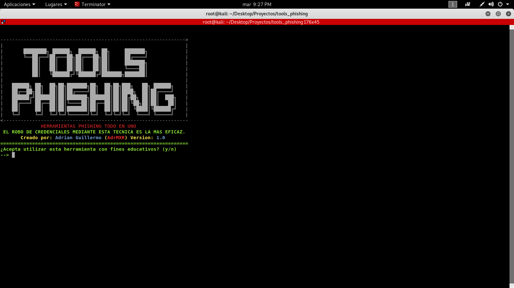
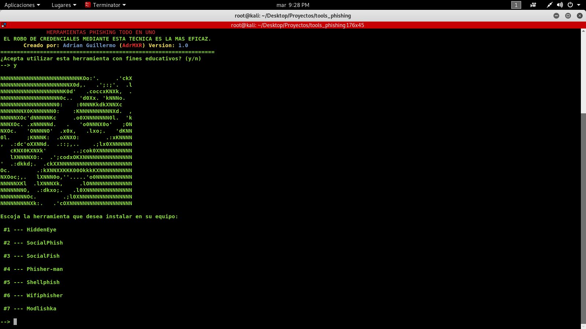

# Tools-phishing
Tools-phishing es un script en Python todo en uno que contiene las herramientas phishing mas populares actualmente. El proposito principal de esta herramienta es automatizar los procesos de descarga y ofrecer herramientas a los usuarios que posiblemente no sabìan de su existencia. Esta tendra constantes actualizaciones ya que se iràn agregando mas herramientas que el administrador descubra o que los propios usuarios recomienden.


### Compatibilidad 

Esta herramienta solo es compatible con Linux y python2.


### Instalación 

```
git clone https://github.com/AdrMXR/tools-phishing.git
```
```
cd tools-phishing
```
```
python tools-phishing.py 
```

### Screenshots




### Creditos
Creador de la herramienta: Adrian Guillermo

Facebook: https://www.facebook.com/Adrian.Guillermo.22

Instagram: https://www.instagram.com/adrian.guillermo22/

YouTube: https://www.youtube.com/channel/UCqEtxJKbIghx6lyymrjfvnA?view_as=subscriber
